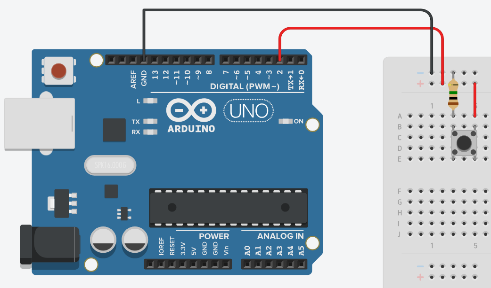

# Arduino Web Lamp Controller

Este projeto permite controlar uma lâmpada virtual em uma página web, utilizando um botão físico conectado ao Arduino. Quando o botão é pressionado, o estado da lâmpada (acesa ou apagada) é alterado tanto no Arduino quanto na interface web, via comunicação com um servidor Node.js.

## Funcionalidade

- **Botão Físico (Arduino):** Quando pressionado, o botão conectado ao Arduino envia um comando para o servidor Node.js.
- **Servidor Node.js:** O servidor recebe o comando do Arduino e atualiza o estado da lâmpada na página web.
- **Interface Web:** A página web exibe a lâmpada que pode ser ligada ou desligada. O estado da lâmpada é atualizado em tempo real.

## Componentes

- **Arduino Uno**
- **Botão (simples, com duas pernas)**
- **LED (simulado na página web)**
- **Resistor de 10kΩ (para o botão)**
- **Servidor Node.js**

## Esquemático do Arduino

Abaixo está o esquemático do circuito para conectar o botão ao Arduino.



## Requisitos

- Arduino Uno
- Node.js
- NPM (Node Package Manager)
- Navegador Web (para visualizar a página)
- Cabo USB para conectar o Arduino ao computador

## Instalação

### Passo 1: Clonar o Repositório

```bash
git clone https://github.com/Dezena14/ArduinoWebLampController.git
cd ArduinoWebLampController
```

### Passo 2: Instalar as Dependências do Node.js

No diretório do projeto, execute o comando abaixo para instalar as dependências necessárias para o servidor Node.js.

```bash
npm install
```

### Passo 3: Configurar o Arduino

Abra o Arduino IDE e conecte o Arduino Uno ao seu computador.
Carregue o código do arquivo `lampControl.ino` no Arduino para controlar o estado do botão e enviar os dados via Serial.

O Arduino irá enviar comandos "on" e "off" através da comunicação serial para o servidor Node.js.

### Passo 4: Iniciar o Servidor Node.js

Agora, inicie o servidor Node.js. No diretório do projeto, execute o comando abaixo:
```bash
npm start
```

O servidor rodará em http://localhost:3000. Acesse este endereço no navegador para visualizar e interagir com a lâmpada virtual.

### Passo 5: Testar o Projeto

Quando o botão físico for pressionado, o estado da lâmpada será alterado tanto no Arduino quanto na interface web em tempo real. O LED na página web será ligado ou desligado conforme o estado do botão no Arduino.

## Autoria

**Autor:** Eduardo Dezena Gonçalves  
**Data de criação:**  dezembro de 2024